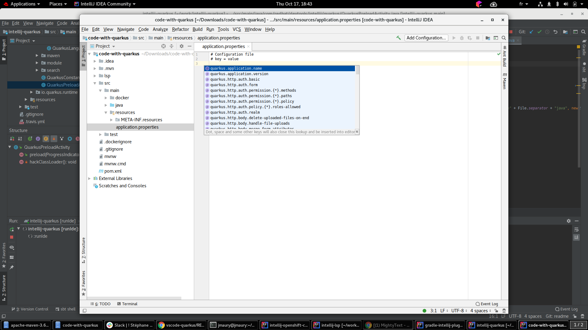

# Quarkus plugin for IntelliJ platform
[plugin-repo]: https://plugins.jetbrains.com/plugin/13234-quarkus
[plugin-version-svg]: https://img.shields.io/jetbrains/plugin/v/13234-quarkus.svg
[plugin-downloads-svg]: https://img.shields.io/jetbrains/plugin/d/13234-quarkus.svg

[![JetBrains plugins][plugin-version-svg]][plugin-repo]
[![JetBrains plugins][plugin-downloads-svg]][plugin-repo]

## Description

This JetBrains IntelliJ plugin provides support for Quarkus development via a 
[Quarkus language server](https://github.com/redhat-developer/quarkus-ls/tree/master/quarkus.ls).

## Quarkus project wizards
  * Generate a Quarkus Maven project, based on https://code.quarkus.io/
    - Call `File -> New -> Module -> Quarkus`
  * ~~Add Quarkus extensions to current Maven-based Quarkus project~~
    - NYI

## Quarkus `application.properties` Features
  * Completion support for Quarkus properties
  * Hover support for Quarkus properties
  * Validation support for Quarkus properties 
  * Support for Quarkus profiles
  * Outline support (flat or tree view)

## ~~Quarkus debug command~~
  NYI
  
  Launches the Maven quarkus:dev plugin and automatically attaches a debugger

  TBD
  
## ~~Quarkus code snippets~~
NYI

This extension provides several code snippets, available when editing Java files:

  * **qrc** - Create a new Quarkus resource class
  * **qrm** - Create a new Quarkus resource method
  * **qtrc** - Create a new Quarkus test resource class
  * **qntrc** - Create a new Quarkus native test resource class

When editing `application.properties` files, you have access to:

  * **qds** - Configure a Quarkus datasource
  * **qj** - Configure a Jaeger tracer

## Requirements

  * Java JDK (or JRE) 8 or more recent

        
## Contributing

This is an open source project open to anyone. Contributions are extremely welcome!

## Feedback

File a bug in [GitHub Issues](https://github.com/redhat-developer/intellij-quarkus/issues).

## License

Eclipse Public License 2.0.
See [LICENSE](LICENSE) file.