<h1> Quarkus Tools for IntelliJ</h1>

[plugin-repo]: https://plugins.jetbrains.com/plugin/13234-quarkus
[plugin-version-svg]: https://img.shields.io/jetbrains/plugin/v/13234-quarkus.svg
[plugin-downloads-svg]: https://img.shields.io/jetbrains/plugin/d/13234-quarkus.svg


[![JetBrains plugins][plugin-version-svg]][plugin-repo]
[![JetBrains plugins][plugin-downloads-svg]][plugin-repo]
[](https://codecov.io/gh/redhat-developer/intellij-quarkus)


## Description
<!-- Plugin description -->
A plugin aimed at Quarkus based development, providing easy bootstrapping and code assist from [Quarkus](https://quarkus.io/) related assets and [Qute](https://quarkus.io/guides/qute-reference).

To provide those support, the plugin consumes:

 * [MicroProfile Language Server](https://github.com/eclipse/lsp4mp/tree/master/microprofile.ls) 
 * [Qute Language Server](https://github.com/redhat-developer/quarkus-ls/tree/master/qute.ls) 

by using [LSP4IJ (Language Server Protocol for Intellij)](https://github.com/redhat-developer/lsp4ij).

<!-- Plugin description end -->

### application.properties support

### Code completion (Ctrl + ENTER)


### Property documentation

Select a property and press Ctrl+Q


### Goto property definition

Select a property and press Ctrl+B


### Syntax validation

Wrong property key names or values are reported


### Property hover in Java files

Property managed in your code through @ConfigProperty:
  * code completion in application.properties is adjusted accordingly if you define new properties
  * hover over the property field will display the current value


### CodeLens / Inlay

When editing a resource class while the current Quarkus application is running in development mode (`./mvnw compile quarkus:dev` or `./gradlew quarkusDev`), there are now CodeLenses that provide the URL for the GET endpoints.

This feature takes into account the path name and the HTTP server port from your application.properties file in order to create the URL.

Clicking on the CodeLens URL will open the URL in your default browser.

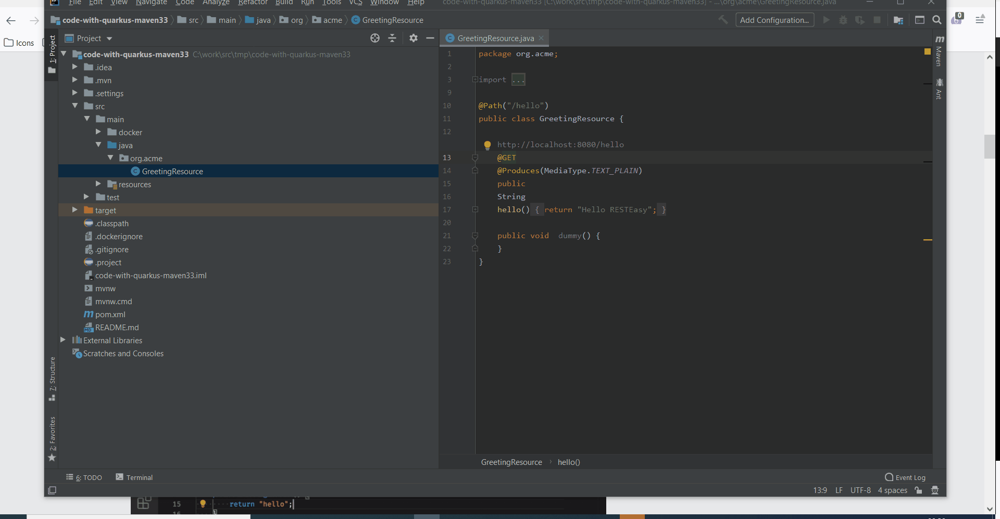

#### InLayHint

InlayHint is now a supported feature. It allows to add inline information about parameters and variables. This is very useful for Qute templates to get type information. InlayHints may also be clickable.

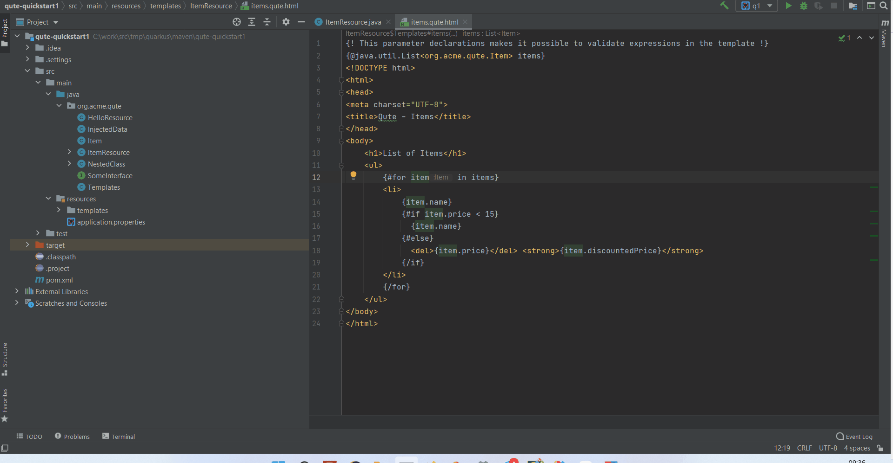

## DocumentHighlight

DocumentHightlight allows to hightlight parts of the document that are related to the current selection. This is useful for Qute templates to highlight matching part of a Qute section.

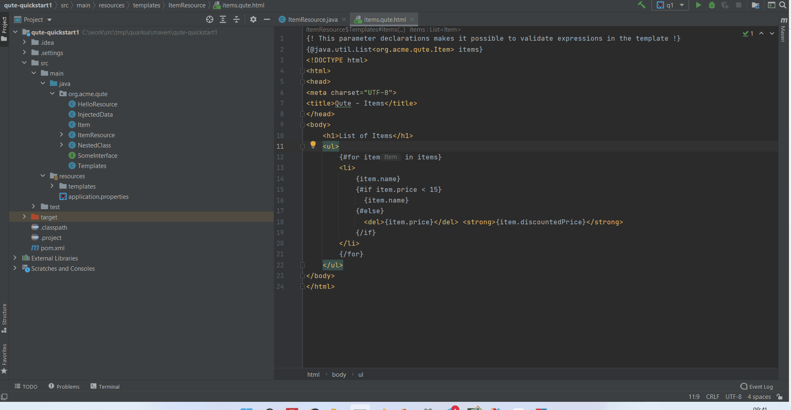

### CodeActions / Quick Fixes

When an error is detected on one of your Quarkus project files, it is highlighted in the source editor
(example when you define one property through `@ConfigProperty` but it is not defined.).

If this error can be fixed through an automatic action, it will be available from the `More actions`
context menu or through the `Alt+Enter` key binding.

In this example, we will add a default value for a property defined though `@ConfigProperty`

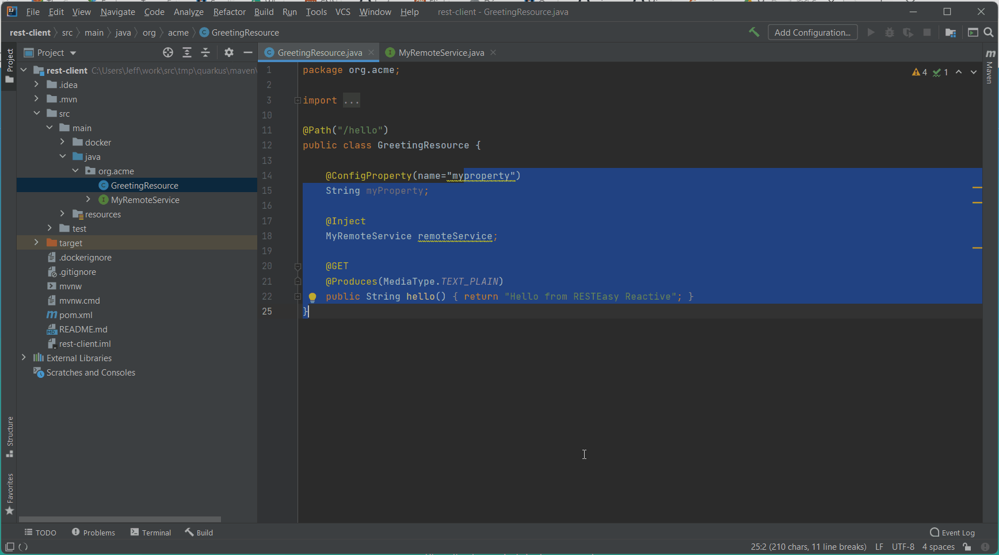

In this another example, a Microprofile REST Client is defined and bound to a REST resource but the
`RestClient` annotation is missing from the binding.

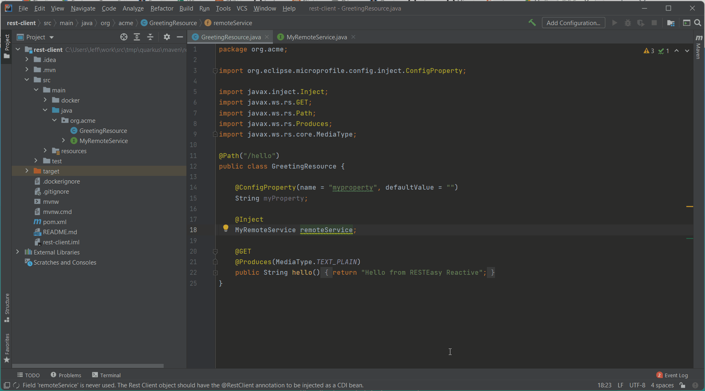

### MicroProfile Health 

Syntax validation is being performed for Java files using the MicroProfile Health assets:


### MicroProfile Fault Tolerance

MicroProfile Health related properties are supported in `application.properties` completion
and syntax validation as soon as you use MicroProfile related annotation in your Java
source files


Methods referenced in `@Fallback(fallbackMethod)` are validated:

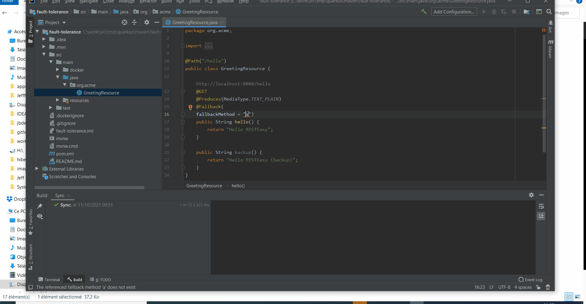

Activating code completion on the `@Fallback(fallbackMethod)` value will get the list of available methods being proposed:

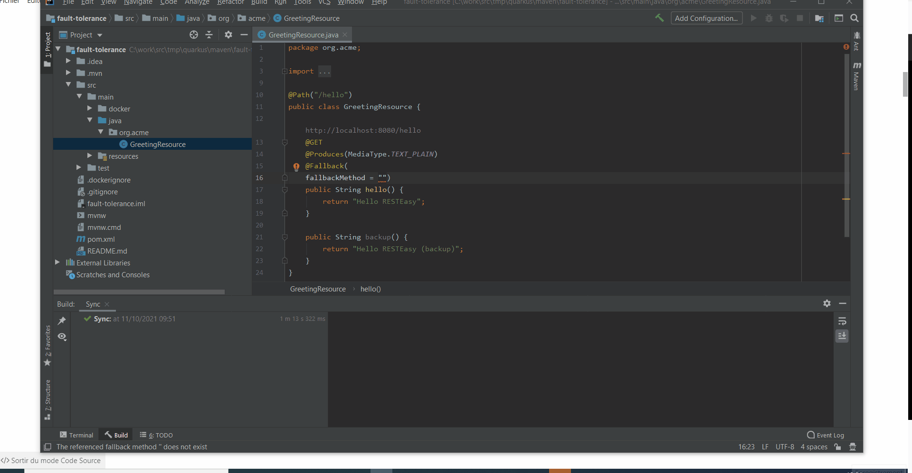


### MicroProfile Rest Client

MicroProfile Rest Client references are checked against valid injections


### MicroProfile LRA

MicroProfile LRA related properties references are supported in `application.properties` completion
and syntax validation as soon as you use MicroProfile LRA in your Quarkus application


### MicroProfile OpenAPI

MicroProfile OpenAPI related properties references are supported in `application.properties` completion
and syntax validation as soon as you use MicroProfile OpenAPI in your Quarkus application


### MicroProfile Metrics

MicroProfile Metrics related properties references are supported in `application.properties` completion
and syntax validation as soon as you use MicroProfile Metrics in your Quarkus application


Invalid use of the `@Gauge` annotation is reported as well:

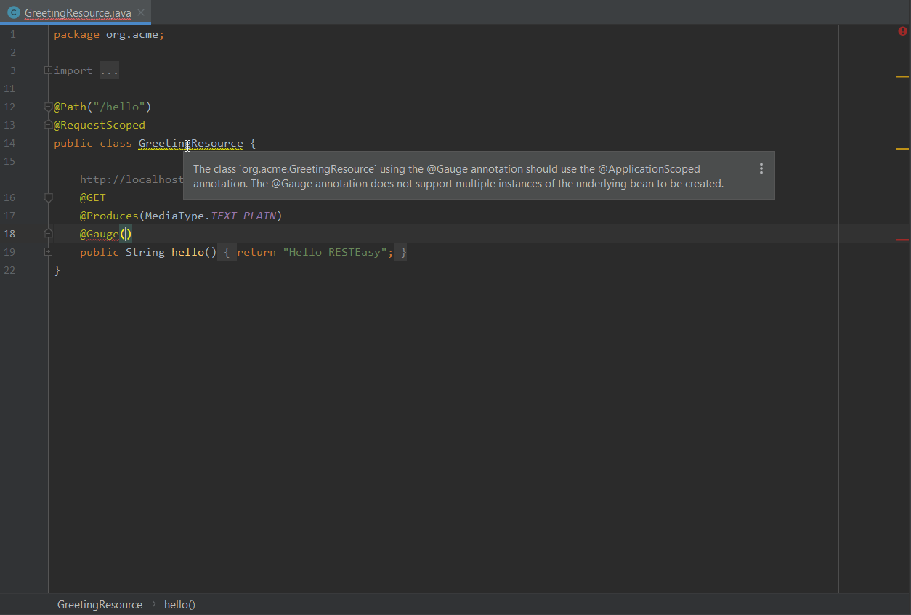

### MicroProfile OpenTracing

MicroProfile OpenTracing related properties references are supported in `application.properties` completion
and syntax validation as soon as you use MicroProfile OpenTracing in your Quarkus application


### application.yaml

### Code completion (Ctrl+ENTER)

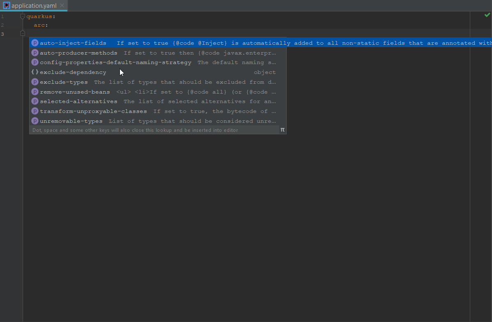

### Property documentation

Select a property and press Ctrl+Q

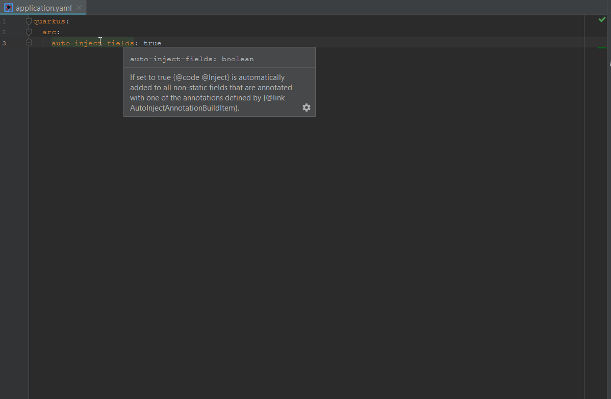

### Syntax validation

Wrong property key names or values are reported

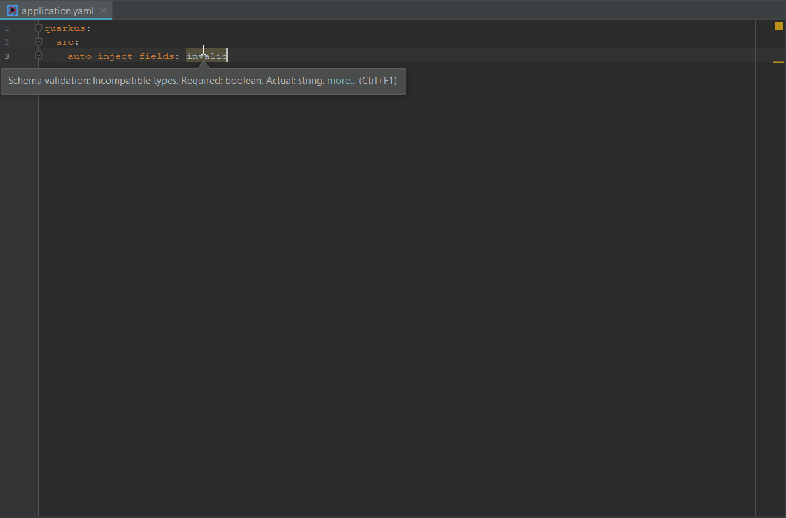

## Qute templates

The [Qute templating engine](https://quarkus.io/guides/qute-reference) is supported in Java file and templates.

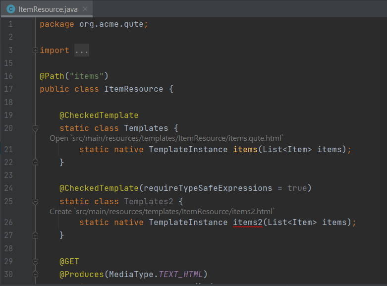

## Quarkus project wizards

Generate a Quarkus Maven project, based on https://code.quarkus.io/. Call `File > New > Module > Quarkus`. It is possible to filter the list of displayed Quarkus extension by name pattern and allow or disallow the inclusion of non platforms Quarkus extensions.

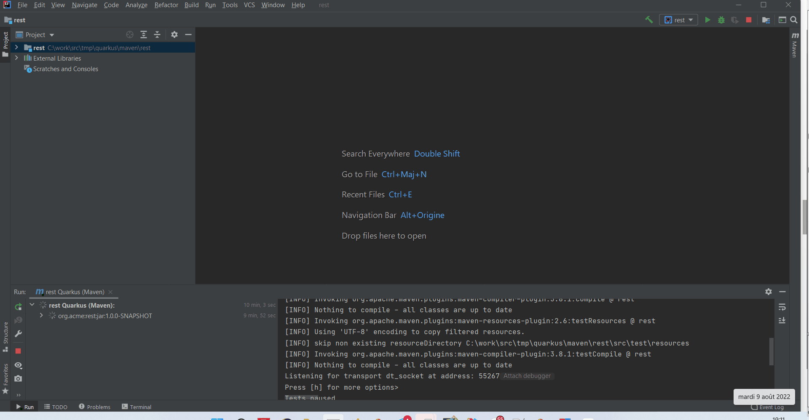

## Quarkus `application.properties` Features
  * Completion support for Quarkus properties
  * Hover support for Quarkus properties
  * Validation support for Quarkus properties 
  * Support for Quarkus profiles
  * Outline support (flat or tree view)

## Quarkus run/debug command

It is possible to run or debug a Quarkus application from the IDE configurations.
Select the `Run -> Edit Configurations...` menu and click the `Add new...` link:

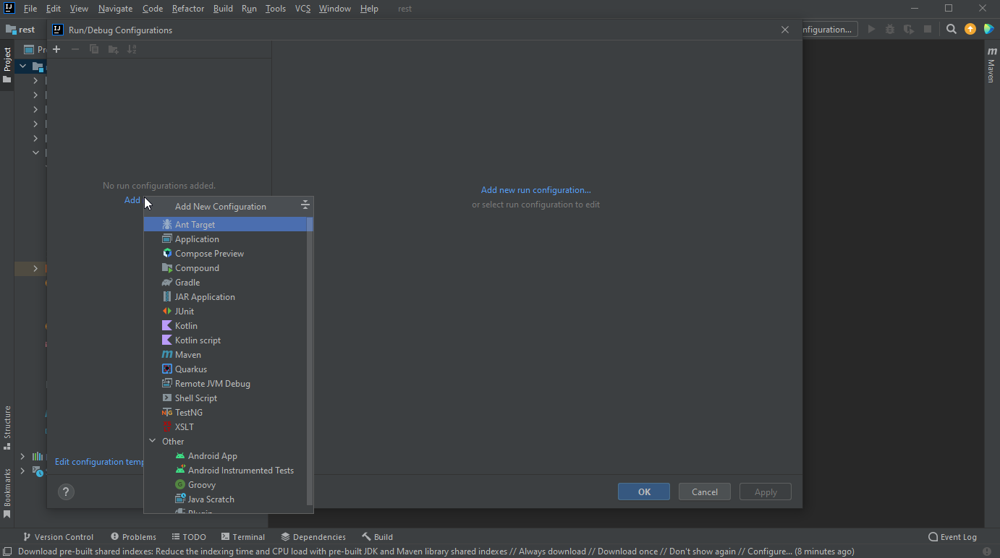

Select the `Quarkus` configuration type:

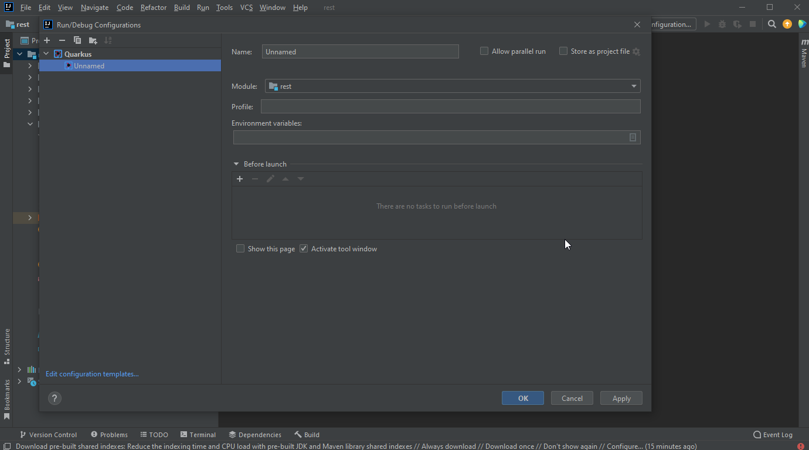

The first module of the project is selected. For single Quarkus projects, it is ok. If you have a multi module Quarkus project, you can change the module to test.
You can also specify a Quarkus profile to use (dev is the default) and environment variables (using the notation VARNAME=varvalue, separated by semicolon)

The click the `OK` button. The configuration will now appear on the top right side of the window:

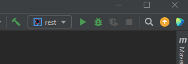

If you click the Run icon, it will start the Quarkus application in dev mode. If you click the Debug button, it will start the Quarkus application in dev mode and connect a local Java debugger to the running application.

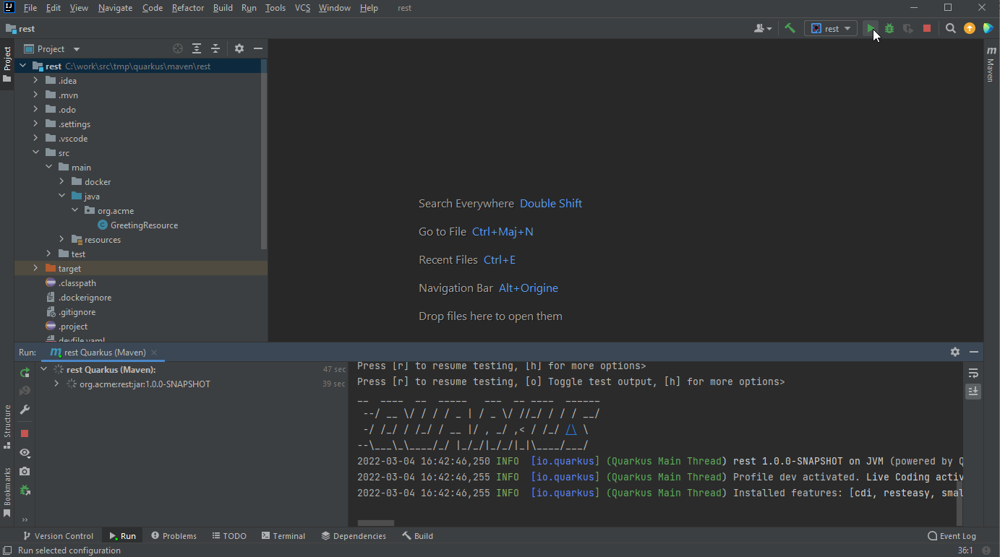

When the console is running, you can open a browser to either the Quarkus DevUI or to the Quarkus application. When the Quarkus application has been started, right click in the console and a sub menu `Quarkus` will be displayed. It has 2 sub menus `Open DevUI` and `Open application`. When one of these menus are selected, a new browser window is opened to the desired location.


## Quarkus code snippets

This plugin provides several code snippets, available when editing Java files:

  * **qrc** - Create a new Quarkus resource class
  * **qrm** - Create a new Quarkus resource method
  * **qtrc** - Create a new Quarkus test resource class
  * **qntrc** - Create a new Quarkus native test resource class

When editing `application.properties` files, you have access to:

  * **qds** - Configure a Quarkus datasource
  * **qj** - Configure a Jaeger tracer


## Requirements

  * Intellij IDEA 2022.3 or more recent (we **try** to support the last 4 major IDEA releases)
  * Java JDK (or JRE) 17 or more recent

    ​    
## Contributing

This is an open source project open to anyone. Contributions are extremely welcome!

### Building

Project is managed by Gradle. So building is quite easy.

#### Building the plugin distribution file

Run the following command:

```sh
./gradlew buildPlugin
```
The plugin distribution file is located in ```build/distributions```.

#### Testing

You can also easily test the plugin. Just run the following command:

```sh
./gradlew runIde
```

#### Unit test infrastructure

The IntelliJ SDK does not provide helpers to create Maven or Gradle based project.
But the Maven and Gradle plugins have some test class helpers but they are not part
of the IntelliJ SDK or the respective plugin distributions.

So we extracted these classes into the ```intellij-community``` folder. But as these
classes are highly linked to the version of the IntelliJ SDK used to build, there is
a script to copy them from the GitHub intellij-community repository.

This script is ```pull_intellij_tests```

If the version of the IntelliJ SDK used to build is changed (see gradle.properties), you must
update the branch in ```pull_intellij_tests``` and run the script again.

#### UI testing

You can perform UI testing by running the following command:

```sh
./gradlew integrationTest 
```
#### Testing nightly builds

You can easily install nightly builds from the nightly channel:

- in IntelliJ, open `Setting > Plugins > [Gear icon] > Manage Plugin Repositories...`
- Add `https://plugins.jetbrains.com/plugins/nightly/13234` and press `OK`
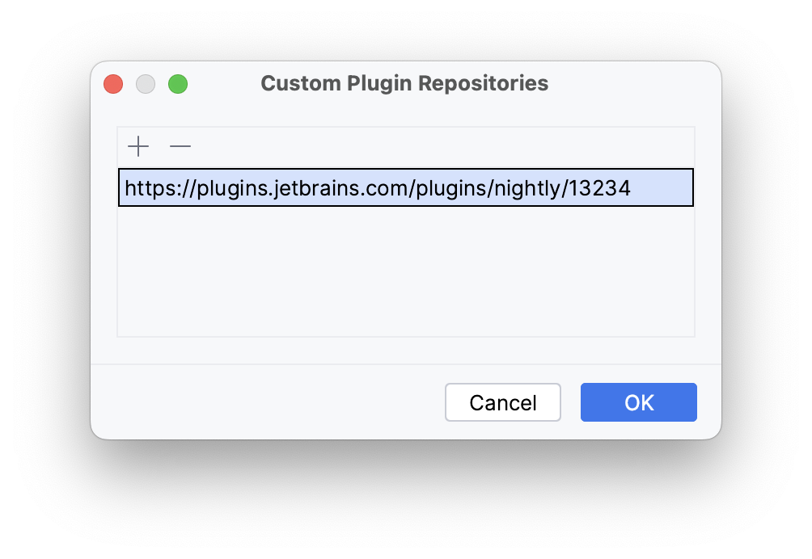
- install the latest `Quarkus Tools` version

Nightly builds are published once a day.


#### Testing the CI builds

You can also download and install CI builds of the latest commits or a specific pull request:

- open the [`Build plugin zip` workflow](https://github.com/redhat-developer/intellij-quarkus/actions/workflows/buildZip.yml)
- click on the build you are interested in
- scroll down and download the `Quarkus Tools <version>.zip` file
- install `Quarkus Tools <version>.zip` into IntelliJ IDEA by following these [instructions](https://www.jetbrains.com/help/idea/managing-plugins.html#install_plugin_from_disk).

Data and Telemetry
==================
The JetBrains IntelliJ Quarkus Tools plugin collects anonymous [usage data](USAGE_DATA.md) and sends it to Red Hat servers to help improve our products and services. Read our [privacy statement](https://developers.redhat.com/article/tool-data-collection) to learn more. This extension respects the Red Hat Telemetry setting which you can learn more about at [https://github.com/redhat-developer/intellij-redhat-telemetry#telemetry-reporting](https://github.com/redhat-developer/intellij-redhat-telemetry#telemetry-reporting)

## Articles

 * [A recap of Quarkus Tools for IntelliJ's latest improvements](https://quarkus.io/blog/intellij-quarkus-recap/)
 * [Quarkus Tools for IntelliJ 1.14.0 released!](https://quarkus.io/blog/intellij-quarkus-tools-1.14.0/)
 * [Quarkus Tools for IntelliJ 1.13.0 released!](https://quarkus.io/blog/intellij-quarkus-tools-1.13.0/)
 * [Quarkus Tools for IntelliJ 1.12.0 released!](https://quarkus.io/blog/intellij-quarkus-tools-1.12.0/)
 * [Quarkus Tools for IntelliJ 1.11.0 released!](https://quarkus.io/blog/intellij-quarkus-tools-1.11.0/)
 * [Quarkus Tools for IntelliJ 1.10.0 released!](https://quarkus.io/blog/intellij-quarkus-tools-1.10.0/)
 * [Quarkus Tools for IntelliJ 1.9.0 released!](https://quarkus.io/blog/intellij-quarkus-tools-1.9.0/)
 * [Quarkus Tools for IntelliJ 1.8.0 released!](https://quarkus.io/blog/intellij-quarkus-tools-1.8.0/)
 * [Quarkus Tools for IntelliJ 1.4.0 released!](https://quarkus.io/blog/intellij-quarkus-tools-1.4.0/)
 * [Quarkus Tools for IntelliJ 1.3.0 released!](https://quarkus.io/blog/intellij-quarkus-tools-1.3.0/)
 * [Quarkus Tools for IntelliJ 1.2.0 released!](https://quarkus.io/blog/intellij-quarkus-tools-1.2.0/)
 * [Quarkus Tools for IntelliJ 1.1.0 released!](https://quarkus.io/blog/intellij-quarkus-tools-1.1.0/)
 * [Quarkus Tools for IntelliJ 1.0.0 released!](https://quarkus.io/blog/intellij-quarkus-tools-1.0.0/)

## Feedback

File a bug in [GitHub Issues](https://github.com/redhat-developer/intellij-quarkus/issues).

## License

Eclipse Public License 2.0.
See [LICENSE](LICENSE) file.
