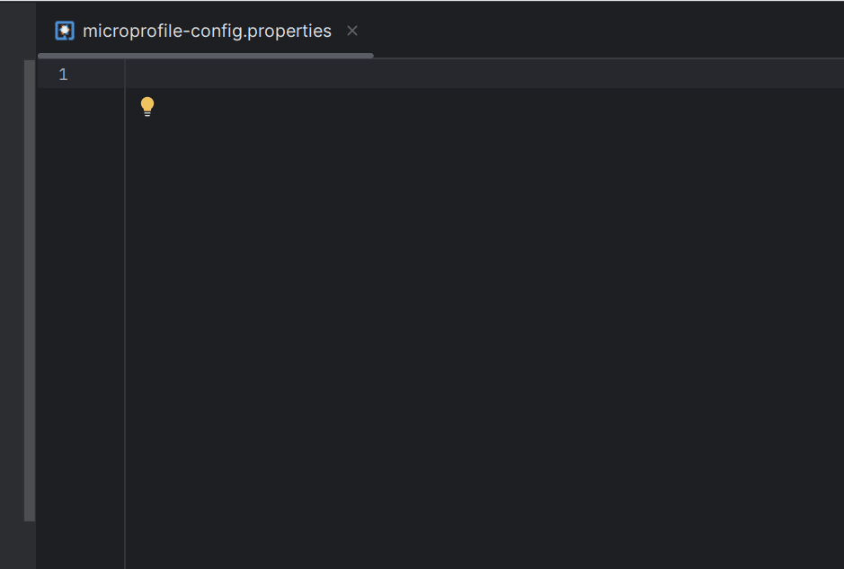
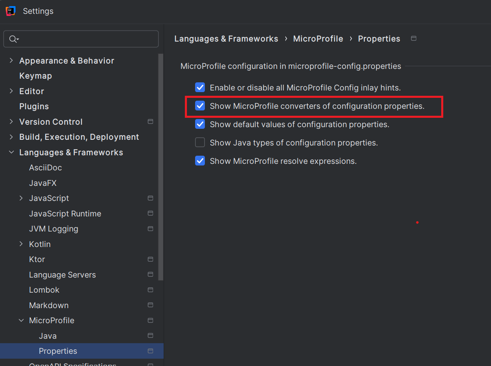
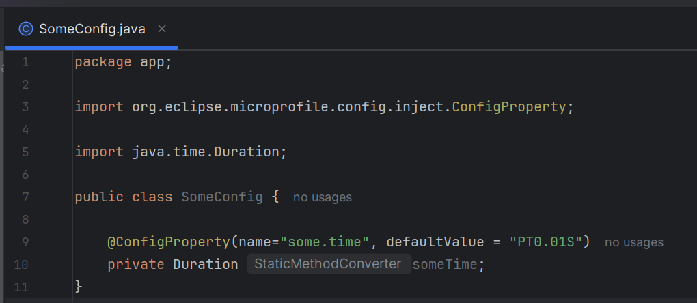
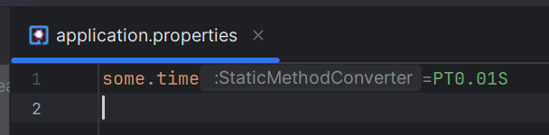
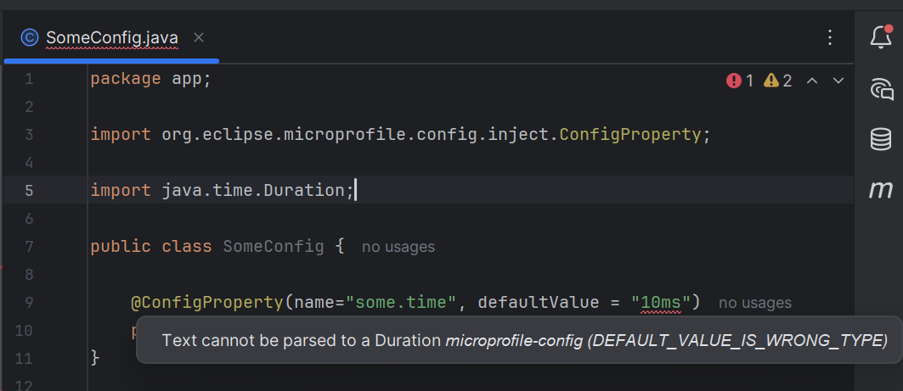
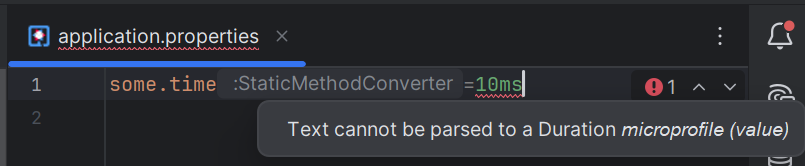
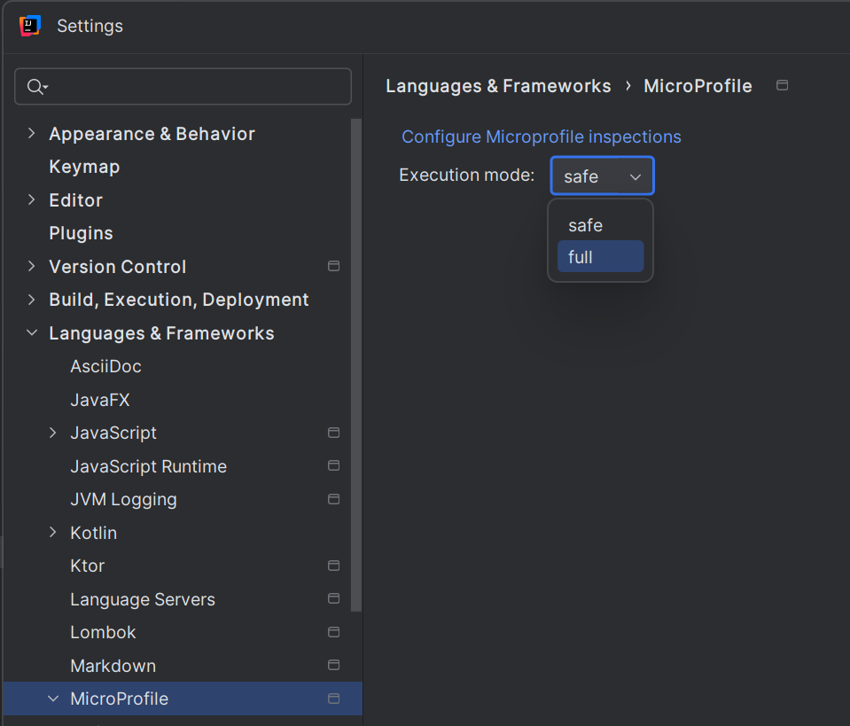
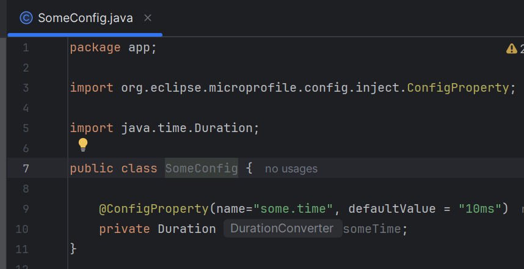

# MicroProfile Editing Support

Quarkus Tools for IntelliJ provides comprehensive editing support for [MicroProfile](https://microprofile.io/) specifications and configuration. MicroProfile is a set of specifications for building cloud-native microservices in Java.

The plugin offers intelligent features for both configuration files and Java source code:

- **Configuration file support** - Completion, validation, hover, and navigation for `application.properties` and `microprofile-config.properties`
- **Java annotation support** - Validation and completion for MicroProfile annotations
- **Type converters** - Smart validation using MicroProfile Config converters
- **Quick fixes** - Automated fixes for common configuration issues

## In Properties Files

MicroProfile Config properties are fully supported in `application.properties` and `microprofile-config.properties` files with intelligent IDE features.

### Features

#### Code Completion

Press `Ctrl+Space` (Windows/Linux) or `⌘Space` (macOS) to get intelligent suggestions for:
- **Property names** - All available MicroProfile Config properties based on your project's dependencies
- **Property values** - Context-aware value suggestions (enums, booleans, numbers, etc.)
- **Nested properties** - Hierarchical property completion for complex configurations

#### Hover Documentation

Hover over any property name to see:
- Property description and documentation
- Expected value type
- Default value (if any)
- Source extension that provides the property

Press `Ctrl+Q` (Windows/Linux) or `F1` (macOS) to open detailed documentation.

#### Go to Definition

Navigate between properties and their usage:
- `Ctrl+B` (Windows/Linux) or `⌘B` (macOS) on a property jumps to:
  - The Java field annotated with `@ConfigProperty` that uses it
  - The configuration class where it's defined
  - The source code that provides the property

#### Validation

The IDE validates properties in real-time:
- **Unknown properties** - Warnings for properties not defined in any extension
- **Invalid values** - Errors for values that don't match the expected type
- **Deprecated properties** - Strikethrough for deprecated configuration
- **Required properties** - Errors when required properties are missing

#### Property Profiles

MicroProfile Config supports profiles (e.g., `%dev`, `%test`, `%prod`) for environment-specific configuration:

```properties
# Default value
greeting.message=Hello

# Development profile
%dev.greeting.message=Hello from Dev

# Production profile  
%prod.greeting.message=Hello from Production
```

The IDE understands profile prefixes and provides completion and validation accordingly.



## In Java Files

MicroProfile annotations in Java source files receive full IDE support including validation, completion, and quick fixes.

### @ConfigProperty

The `@ConfigProperty` annotation injects configuration values into your Java code.

#### Example

```java
import org.eclipse.microprofile.config.inject.ConfigProperty;
import jakarta.inject.Inject;

public class GreetingService {
    
    @Inject
    @ConfigProperty(name = "greeting.message")
    String message;
    
    @Inject
    @ConfigProperty(name = "greeting.suffix", defaultValue = "!")
    String suffix;
}
```

#### IDE Features

- **Validation** - Warns if the property is not defined in `application.properties` (unless `defaultValue` is provided)
- **Hover** - Shows the current value from your configuration file
- **Quick fix** - Offers to create the missing property in `application.properties`
- **Go to definition** - Navigate from Java field to the property definition
- **Refactoring** - Rename the property across Java and properties files

### MicroProfile Health

[MicroProfile Health](https://github.com/eclipse/microprofile-health) provides health check endpoints.

#### Validation

The IDE validates:
- `@Liveness` and `@Readiness` annotations are used correctly
- Health check classes implement `HealthCheck` interface
- `call()` method returns `HealthCheckResponse`

#### Example

```java
import org.eclipse.microprofile.health.HealthCheck;
import org.eclipse.microprofile.health.HealthCheckResponse;
import org.eclipse.microprofile.health.Liveness;

@Liveness
public class DatabaseHealthCheck implements HealthCheck {
    
    @Override
    public HealthCheckResponse call() {
        return HealthCheckResponse.up("Database connection OK");
    }
}
```

Related properties in `application.properties` receive completion and validation for the health extension.

### MicroProfile Fault Tolerance

[MicroProfile Fault Tolerance](https://github.com/eclipse/microprofile-fault-tolerance) provides resilience patterns like retry, timeout, circuit breaker, bulkhead, and fallback.

#### @Fallback Annotation

The IDE validates and provides completion for the `fallbackMethod` attribute:

```java
import org.eclipse.microprofile.faulttolerance.Fallback;

public class GreetingService {
    
    @Fallback(fallbackMethod = "fallbackGreeting")
    public String greeting() {
        // Primary method
        return callExternalService();
    }
    
    public String fallbackGreeting() {
        // Fallback method
        return "Hello from fallback";
    }
}
```

#### IDE Features

- **Validation** - Ensures the `fallbackMethod` exists and has compatible signature
- **Completion** - Lists available methods when typing `fallbackMethod = ""`
- **Go to definition** - Navigate from annotation to the fallback method
- **Quick fix** - Create the fallback method if it doesn't exist

#### Other Fault Tolerance Annotations

The IDE supports configuration properties for:
- `@Retry` - Retry policies
- `@Timeout` - Operation timeouts  
- `@CircuitBreaker` - Circuit breaker configuration
- `@Bulkhead` - Bulkhead patterns
- `@Asynchronous` - Async execution

All related properties in `application.properties` receive completion and validation.

### MicroProfile REST Client

[MicroProfile REST Client](https://github.com/eclipse/microprofile-rest-client) provides type-safe REST client interfaces.

#### Example

```java
import org.eclipse.microprofile.rest.client.inject.RegisterRestClient;
import jakarta.ws.rs.GET;
import jakarta.ws.rs.Path;

@RegisterRestClient(configKey = "hello-service")
public interface HelloService {
    
    @GET
    @Path("/hello")
    String hello();
}
```

#### IDE Features

- **Validation** - Checks that `@RestClient` is used with `@Inject` for proper injection
- **Quick fix** - Adds missing `@RestClient` annotation
- **Properties completion** - Suggests REST client configuration properties:
  ```properties
  hello-service/mp-rest/url=http://localhost:8080
  hello-service/mp-rest/scope=jakarta.inject.Singleton
  ```

### MicroProfile OpenAPI

[MicroProfile OpenAPI](https://github.com/eclipse/microprofile-openapi) generates OpenAPI documentation.

Properties like `mp.openapi.extensions.*` receive completion and validation in `application.properties`.

### MicroProfile Metrics

[MicroProfile Metrics](https://github.com/eclipse/microprofile-metrics) provides application metrics.

#### @Gauge Validation

The IDE validates `@Gauge` usage:
- Must be on a method with no parameters
- Return type must be numeric
- Method must not return `void`

```java
import org.eclipse.microprofile.metrics.annotation.Gauge;

public class MemoryGauge {
    
    @Gauge(name = "memory.used", unit = MetricUnits.BYTES)
    public long getMemoryUsed() {
        return Runtime.getRuntime().totalMemory() - Runtime.getRuntime().freeMemory();
    }
}
```

### MicroProfile LRA

[MicroProfile LRA](https://github.com/eclipse/microprofile-lra) (Long Running Actions) for distributed transactions.

Configuration properties for LRA receive completion and validation.

### MicroProfile OpenTracing

[MicroProfile OpenTracing](https://github.com/eclipse/microprofile-opentracing) integrates distributed tracing.

Configuration properties for tracing receive completion and validation.

## Type Converters

MicroProfile Config uses converters to transform string values from configuration files into Java types. The IDE can display which converter is used for each property and validate values according to the converter's rules.

### Example: Duration Property

Consider this class that injects a `Duration` configuration property:

```java
package app;

import org.eclipse.microprofile.config.inject.ConfigProperty;
import java.time.Duration;

public class SomeConfig {

    @ConfigProperty(name="some.time", defaultValue = "PT0.01S")
    private Duration someTime;
}
```

The `Duration` type requires a converter to parse string values like `"PT0.01S"` (ISO-8601 duration format) or `"10ms"` into Java `Duration` objects.

### Displaying Converter Information

The IDE can show which MicroProfile converter is used for each property using inlay hints.

#### Enable Converter Display

To see converter information inline:

1. Go to **Settings > Languages & Frameworks > MicroProfile > Properties**
2. Check **"Show MicroProfile converters of configuration properties"**



#### Converter Hints in Java Files

Once enabled, inlay hints appear next to `@ConfigProperty` fields showing the converter name. In this example, [StaticMethodConverter](https://github.com/smallrye/smallrye-config/blob/a3b49a863ed14664a82323ee66149bf5f223ef8f/implementation/src/main/java/io/smallrye/config/Converters.java#L1344) is displayed, indicating the converter used for the `Duration` type.



#### Converter Hints in Properties Files

The converter information also appears in `application.properties` files, prefixed with a colon (`:StaticMethodConverter`), helping you understand how values will be parsed.



### Value Validation

The IDE validates configuration values according to the converter's parsing rules. Invalid values are highlighted with error markers.

#### Example: Invalid Duration Format

If you change the value to `"10ms"` (a format not supported by the default SmallRye converter), the IDE displays a validation error.

**In Java File (defaultValue):**

The error appears on the `defaultValue` attribute with the message: *"Text cannot be parsed to a Duration microprofile-config (DEFAULT_VALUE_IS_WRONG_TYPE)"*



**In Properties File:**

The same validation error appears when using `10ms` in `application.properties`:



### Execution Mode: Safe vs Full

The validation behavior depends on the **execution mode** setting, which determines which converters are used for validation.

#### Safe Mode (Default)

By default, the IDE uses **safe mode**, which relies on an embedded SmallRye converter implementation. This mode:
- Works without running your application
- Uses standard MicroProfile converters
- May not support framework-specific extensions (e.g., Quarkus's `"10ms"` format)
- **Does not execute project code** - safe for untrusted projects

#### Full Mode

**Full mode** executes converters from your actual project classpath, including framework-specific implementations.

To switch to full mode:

1. Go to **Settings > Languages & Frameworks > MicroProfile**
2. Under **"Configure MicroProfile inspections"**, change **Execution mode** from `safe` to `full`



> **⚠️ Security Warning**: Full mode executes converter code from your project's classpath. Only use full mode on projects you trust. A malicious converter could execute arbitrary code during validation. When working with untrusted code or projects from unknown sources, keep the execution mode on **safe**.

#### Full Mode Example: Quarkus DurationConverter

Quarkus provides its own [DurationConverter](https://github.com/quarkusio/quarkus/blob/main/core/runtime/src/main/java/io/quarkus/runtime/configuration/DurationConverter.java) that supports additional formats like `"10ms"`, `"5s"`, etc.

When you set execution mode to **full** in a Quarkus project:
- The IDE uses Quarkus's `DurationConverter` instead of the default SmallRye converter
- The value `"10ms"` is now valid and displays no error
- The inlay hint shows `DurationConverter` instead of `StaticMethodConverter`



#### When to Use Each Mode

| Mode | Use When | Converters Used | Performance | Security |
|------|----------|----------------|-------------|----------|
| **Safe** | Standard MicroProfile projects or untrusted code | Embedded SmallRye | Fast (no project execution) | ✅ Safe |
| **Full** | Trusted projects with framework-specific formats | Your project's converters | Slower (requires classpath loading) | ⚠️ Executes project code |

**Recommendation**: Use **safe mode** for general development and when working with untrusted projects. Only switch to **full mode** for trusted projects when you need framework-specific converter validation.

## Keyboard Shortcuts

Common shortcuts for MicroProfile editing:

| Action | Windows/Linux | macOS |
|--------|---------------|-------|
| Code completion | `Ctrl+Space` | `⌘Space` |
| Go to definition | `Ctrl+B` | `⌘B` |
| Quick documentation | `Ctrl+Q` | `F1` |
| Show quick fixes | `Alt+Enter` | `⌥Enter` |
| Rename | `Shift+F6` | `⇧F6` |

## Configuration Settings

Access MicroProfile settings at:
- **Settings > Languages & Frameworks > MicroProfile**

Available options:
- Enable/disable inlay hints for configuration properties
- Show/hide MicroProfile converters
- Show/hide default values
- Show/hide Java types
- Configure execution mode (safe/full)

## Next Steps

- Learn about [Quarkus-specific features](../quarkus/EditingSupport.md) that extend MicroProfile
- Explore [Quarkus run configurations](../quarkus/RunningSupport.md) for testing your MicroProfile applications
- See the [Quarkus wizard](../quarkus/Wizard.md) to create projects with MicroProfile extensions

## Additional Resources

- [MicroProfile Specifications](https://microprofile.io/specifications/)
- [MicroProfile Config Specification](https://github.com/eclipse/microprofile-config)
- [Quarkus MicroProfile Guide](https://quarkus.io/guides/#microprofile)
- [SmallRye Config Documentation](https://smallrye.io/smallrye-config/)
