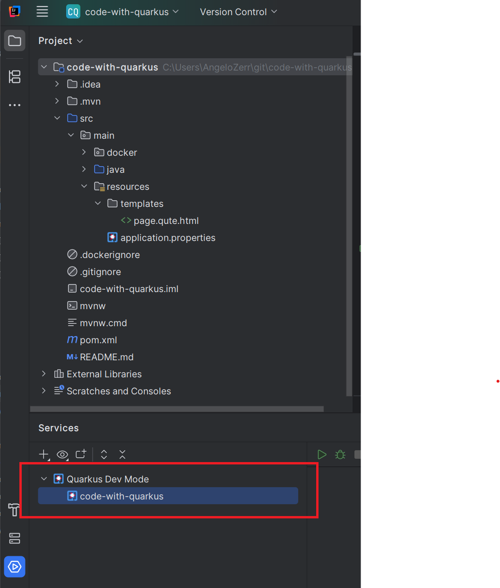
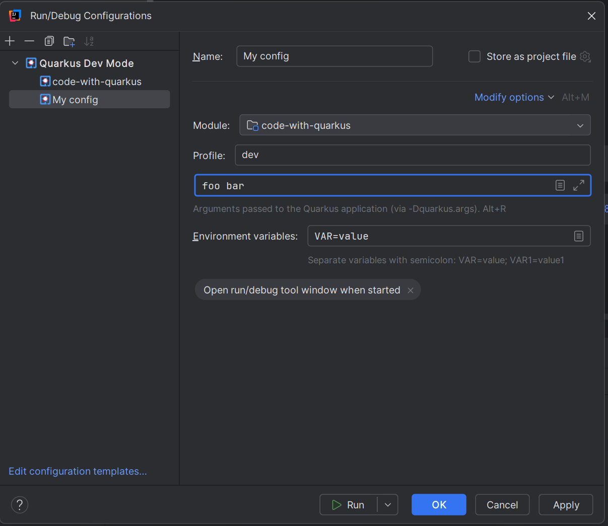

# Configure Quarkus Dev Mode

TODO...

When you open an existing Quarkus project or [create a new project](./Wizard.md) the services view 
should create Quarkus run configuration automatically

You can also create your own config

# Run/Debug Quarkus Dev Mode

