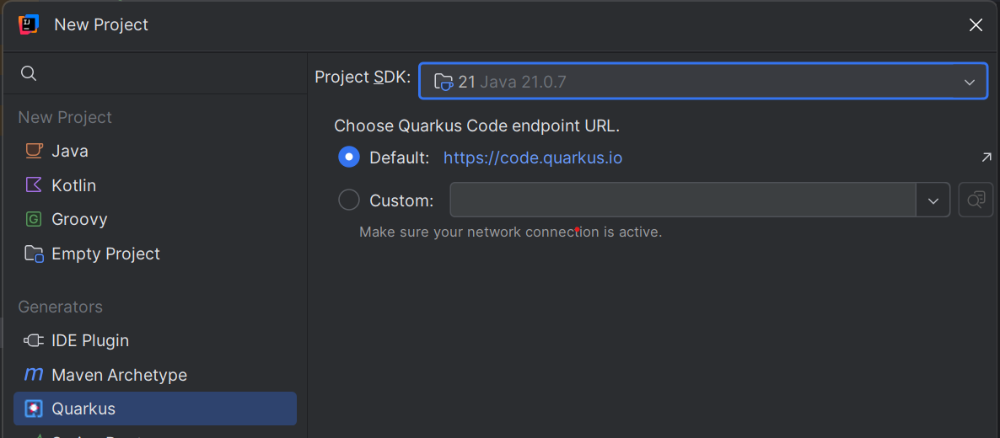
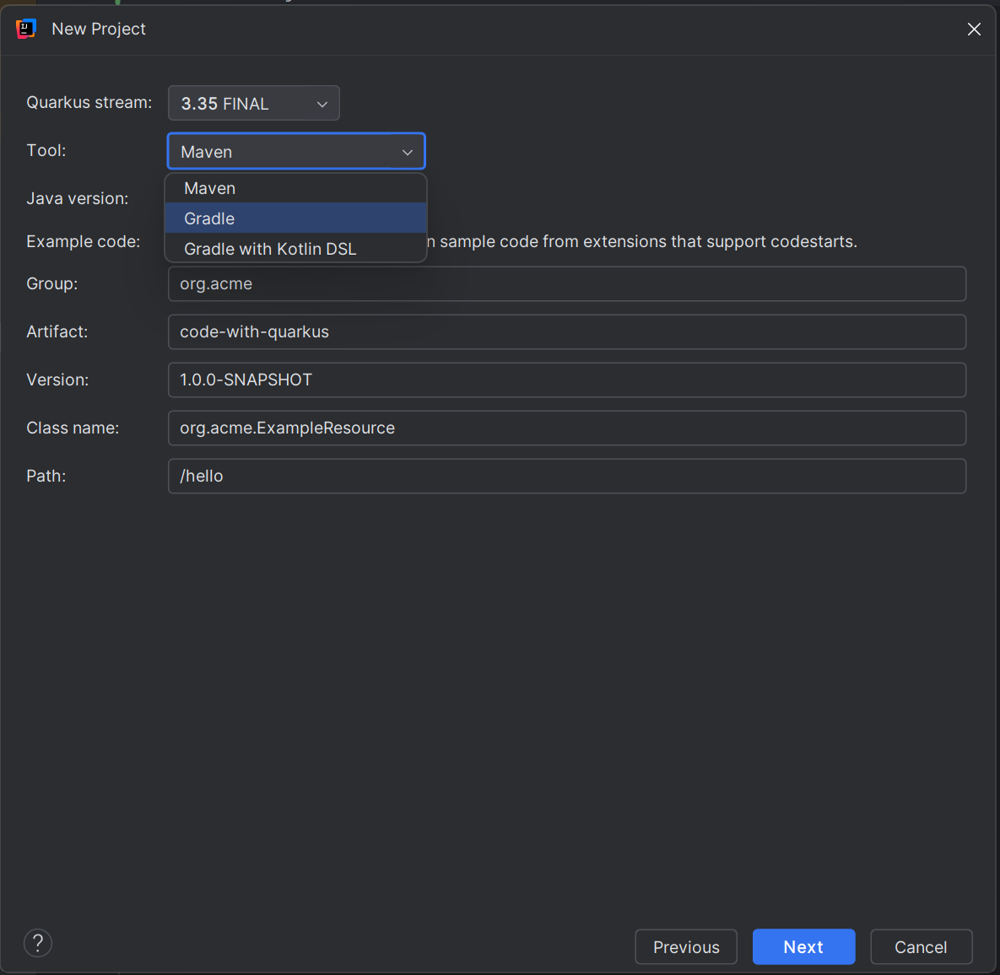
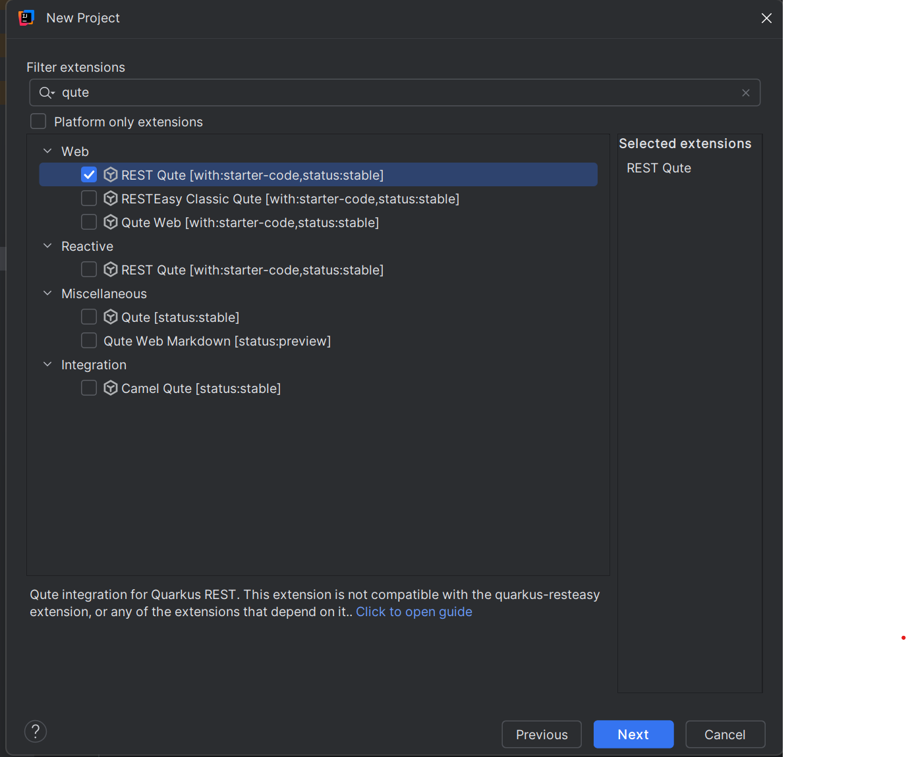
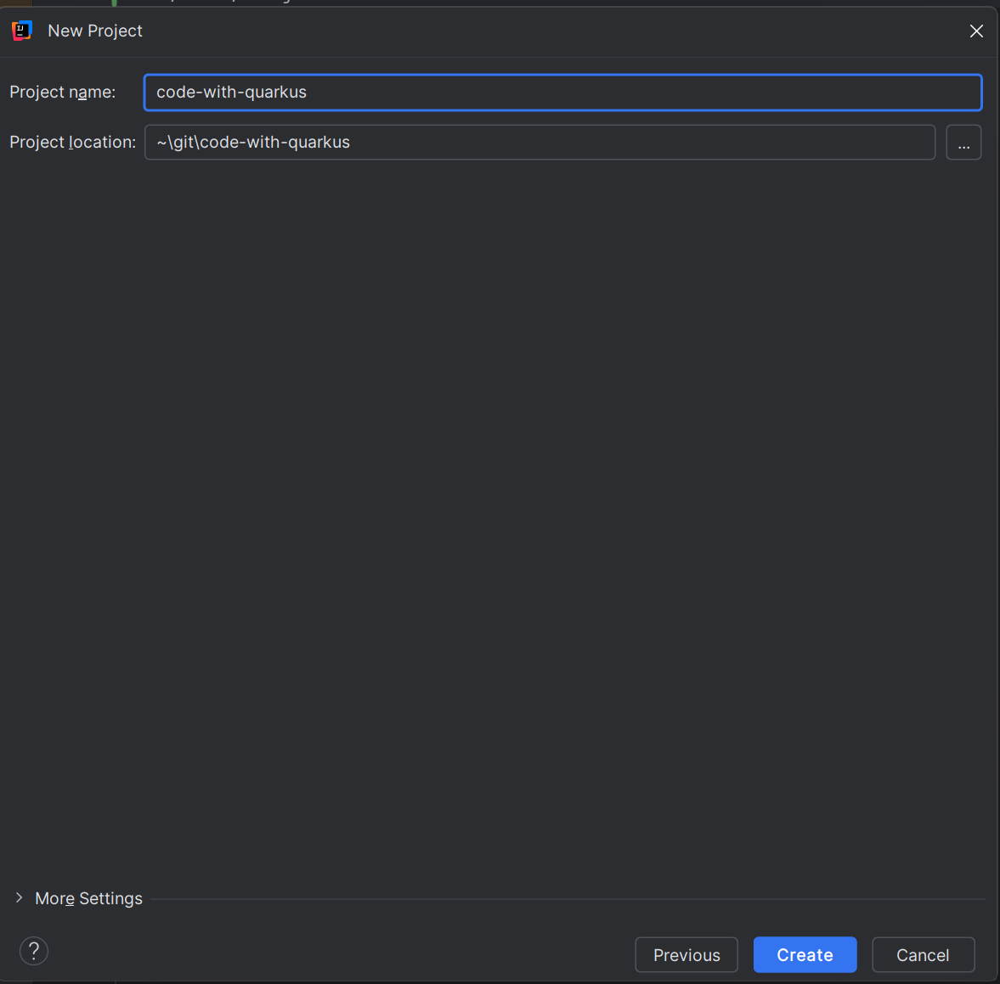
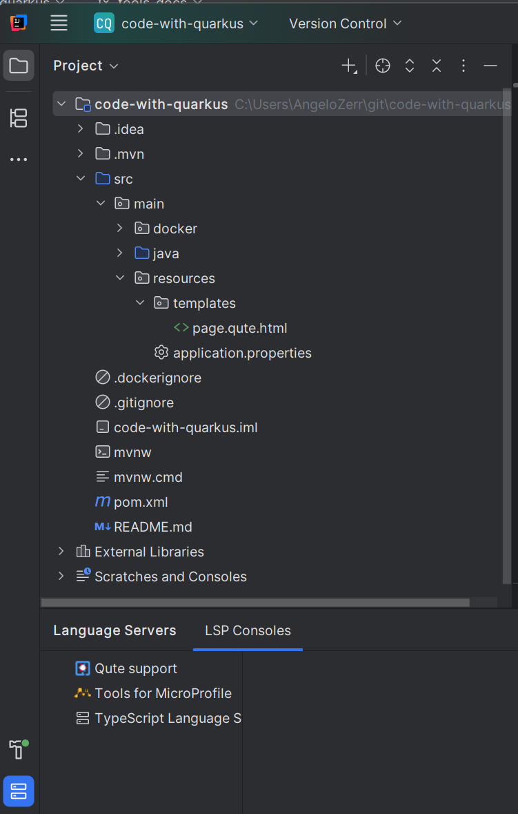

# Create Quarkus Application

The Quarkus wizard helps you bootstrap a new Quarkus project with your choice of extensions, build tool, and configuration. The wizard connects to [code.quarkus.io](https://code.quarkus.io) (or a custom endpoint) to generate your project.

## Prerequisites

- IntelliJ IDEA 2024.2 or later
- Java JDK 17 or later
- Internet connection (to connect to code.quarkus.io)

## Step 1: Open the New Project Wizard

To create a new Quarkus project, go to **File > New > Project**.

In the **New Project** dialog:
1. Select **Quarkus** from the **Generators** section on the left
2. Choose your **Project SDK** (Java 21 or later recommended)
3. Select the **Quarkus Code endpoint URL**:
   - **Default**: `https://code.quarkus.io` (recommended)
   - **Custom**: Specify your own Quarkus code generator endpoint

Click **Next** to proceed to project configuration.

## Step 2: Configure Your Project

Configure the basic project settings:

- **Quarkus stream**: Select the Quarkus version (e.g., `3.35 FINAL`)
- **Tool**: Choose your build tool
  - Maven
  - Gradle
  - Gradle with Kotlin DSL
- **Java version**: Select your Java version
- **Example code**: Check this to include sample code from extensions that support codestarts

### Project Coordinates

- **Group**: Your project's group ID (e.g., `org.acme`)
- **Artifact**: Your project's artifact ID (e.g., `code-with-quarkus`)
- **Version**: Initial version (e.g., `1.0.0-SNAPSHOT`)

### REST Endpoint (Optional)

If you plan to create a REST API, configure:
- **Class name**: The REST resource class name (e.g., `org.acme.ExampleResource`)
- **Path**: The REST endpoint path (e.g., `/hello`)

Click **Next** to select extensions.

## Step 3: Select Quarkus Extensions

Choose the Quarkus extensions you need for your project. Extensions add capabilities like REST APIs, databases, messaging, templates, and more.

### Filtering Extensions

Use the **Filter extensions** search box to quickly find extensions:
- Type keywords like "qute", "rest", "database", etc.
- Extensions are organized by categories: **Web**, **Reactive**, **Data**, **Messaging**, etc.

### Extension Information

Each extension shows:
- Extension name
- Starter code availability (`[with:starter-code]`)
- Stability status (`[status:stable]`, `[status:preview]`, etc.)

Selected extensions appear in the **Selected extensions** panel on the right.

### Platform Only Extensions

Check **Platform only extensions** to show only officially supported Quarkus platform extensions.

> **Note**: Some extensions may be incompatible with each other. The wizard will display a warning at the bottom if incompatibilities are detected.

Click **Next** to proceed.

## Step 4: Set Project Name and Location

Specify where to create your project:

- **Project name**: The name of your IntelliJ project (defaults to the artifact ID)
- **Project location**: The directory where the project will be created

You can expand **More Settings** for additional configuration options.

Click **Create** to generate your Quarkus project.

## Step 5: Generated Project

Once created, your Quarkus project will open in IntelliJ IDEA with:

### Project Structure

- `src/main/java` - Your Java source files
- `src/main/resources` - Resources including:
  - `application.properties` - Quarkus configuration
  - `templates/` - Qute templates (if Qute extension selected)
  - `META-INF/resources/` - Static web resources
- `pom.xml` or `build.gradle` - Build configuration
- Maven wrapper (`mvnw`, `mvnw.cmd`) or Gradle wrapper

### Language Server Support

The **LSP Consoles** tab at the bottom shows active language servers:
- **Qute support** - For Qute template editing (if Qute extension selected)
- **Tools for MicroProfile** - For MicroProfile and Quarkus support

## Next Steps

Now that your project is created:

1. **Configure properties**: Edit `application.properties` to configure your application - see [Editing Support](./EditingSupport.md)
2. **Run your application**: Use the Quarkus run configuration - see [Running Support](./RunningSupport.md)
3. **Edit Qute templates**: If you selected Qute, start editing templates with full IDE support - see [Qute Editing Support](../qute/EditingSupport.md)
4. **Add dependencies**: Use the wizard again or manually edit `pom.xml`/`build.gradle`

## Tips

- **Extension selection**: You can always add extensions later by editing your build file or using the Quarkus CLI
- **Example code**: Enable "Example code" to get starter code that helps you learn how to use extensions
- **Custom endpoint**: Use a custom endpoint if you have an internal code.quarkus.io instance
- **Offline mode**: If you have connectivity issues, consider using the [Quarkus CLI](https://quarkus.io/guides/cli-tooling) to generate projects offline
