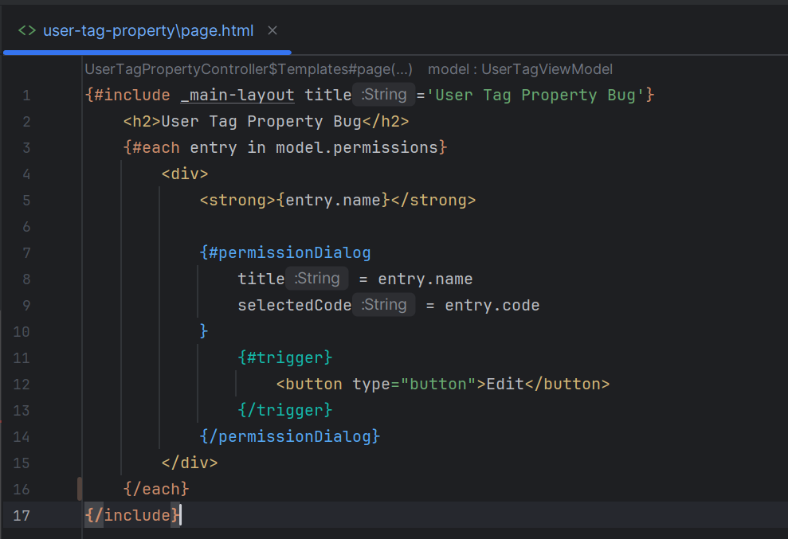
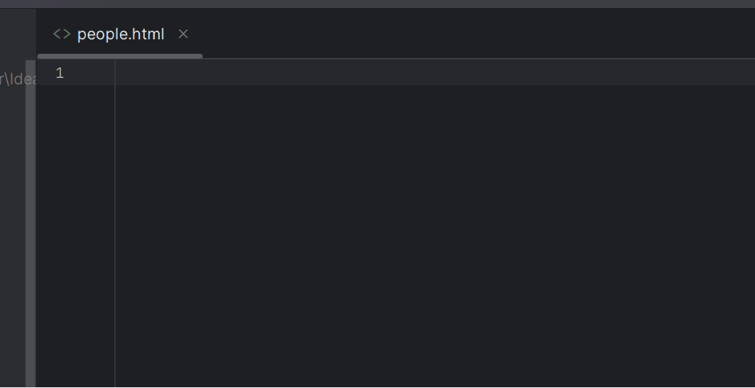
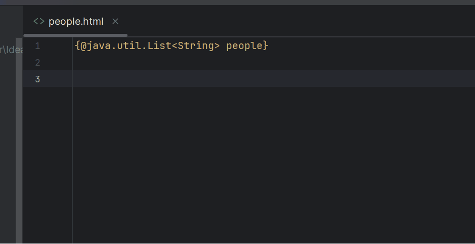
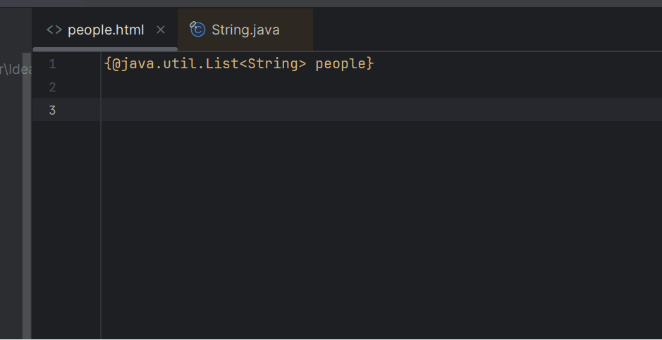
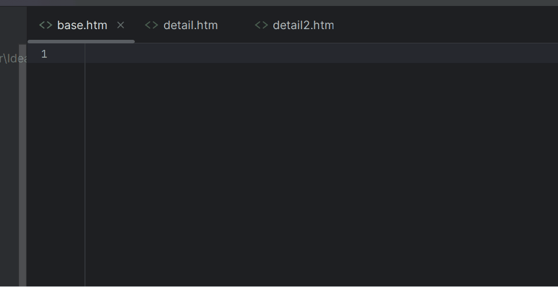
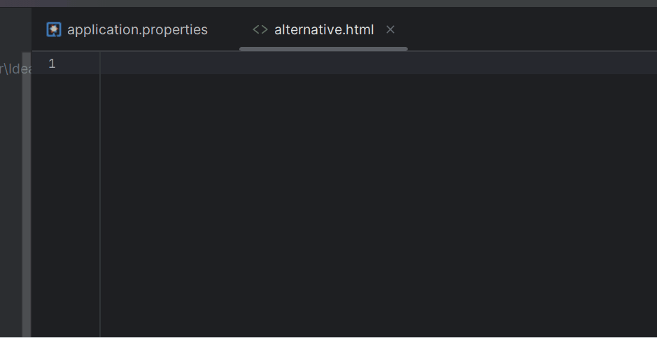
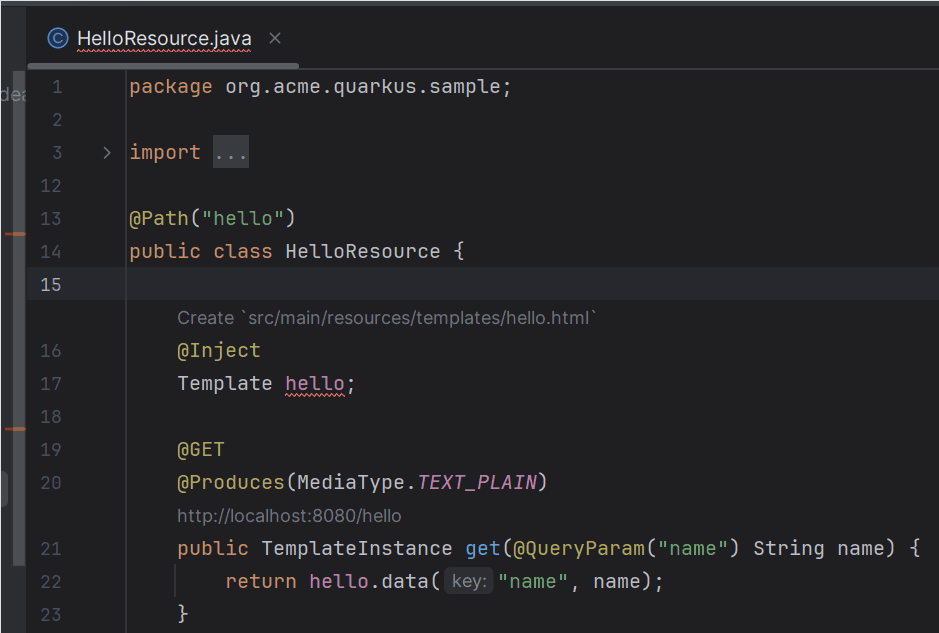

# Qute Editing Support

Quarkus Tools for IntelliJ provides comprehensive editing support for [Qute templates](https://quarkus.io/guides/qute-reference), the type-safe templating engine used in Quarkus. 

The plugin offers intelligent features including:
- **Code completion** for expressions, parameters, and sections
- **Validation** with real-time error detection
- **Hover documentation** for types and properties
- **Go to definition** for navigating between templates and Java code
- **Rename refactoring** across templates and Java files
- **Syntax coloration** with semantic highlighting

These features work seamlessly with Qute extensions and frameworks:
- [Roq](./RoqSupport.md) - Static site generator
- [Renarde](./RenardeSupport.md) - Web framework
- [Web Bundler](./WebBundler.md) - Asset management

## Syntax Coloration

Qute templates support advanced syntax coloration using semantic tokens. This allows the editor to distinguish between different types of Qute elements with appropriate colors and styles.

### Semantic Token Types

The syntax highlighter can differentiate:
- **Core tags** - Built-in Qute sections like `{#include}`, `{#each}`, `{#if}`
- **User tags** - Custom tags defined in your project
- **Slot/Insert tags** - Tags used for template composition (`{#trigger}`, `{/trigger}`)
- **Expressions** - Variable references and method calls
- **Parameters** - Type declarations with `{@...}`

This color differentiation makes it easier to understand template structure at a glance.



## Parameter Declaration

[Parameter declarations](https://quarkus.io/guides/qute-reference#typesafe_expressions) enable type-safe templates by explicitly declaring the types of data passed to your templates. When you declare parameters, the IDE provides full Java type information for completion, validation, and navigation.

### Declaring Parameters

Use the `{@...}` syntax to declare template parameters with their Java types:

```qute
{@java.util.List<String> people}
{@org.acme.User currentUser}
{@boolean isAdmin}
```

### IDE Support for Parameters

When you type `{@`, the IDE provides:
- **Completion** for Java class names and types
- **Import suggestions** for fully qualified names
- **Validation** to ensure the type exists
- **Hover** to see type documentation

Once declared, parameters unlock type-aware features for the rest of your template.



### Using Parameters

After declaring parameters, you can use them in:
- [Expressions](#expressions) - Access properties and methods
- [Loop Sections](#loop-section) - Iterate over collections
- [Conditional Sections](#conditional-sections) - Control flow based on values

## Expressions

[Qute expressions](https://quarkus.io/guides/qute-reference#expressions) allow you to access data and call methods in your templates. The IDE provides full support for Java-like property access and method calls with type safety.

### Expression Syntax

Access object properties and methods using dot notation:

```qute
{@java.util.List<String> people}

{people.size}           <!-- Property access -->
{people.get(0)}         <!-- Method call with parameter -->
{people.isEmpty}        <!-- Boolean property -->
```

### IDE Features for Expressions

When you type `{` followed by a variable name:
- **Completion** shows available properties and methods based on the Java type
- **Hover** displays method signatures and return types
- **Validation** checks that properties and methods exist
- **Go to definition** (Ctrl+B / Cmd+B) jumps to the Java source

The IDE understands Java generics, so `{people.get(0).toUpperCase}` knows the result is a `String`.



### CheckedTemplate Support

For templates using `@CheckedTemplate`, the IDE provides completion based on your Java data model classes, ensuring type safety between your Java code and templates.

## Loop Section

The [`{#for}` section](https://quarkus.io/guides/qute-reference#loop_section) enables iteration over collections. The IDE provides smart completion and type inference for loop variables.

### Basic Loop Syntax

```qute
{@java.util.List<String> people}

{#for person in people}
    {person.length}      <!-- IDE knows 'person' is a String -->
    {person.toUpperCase}
{/for}
```

### IDE Support for Loops

When writing a `{#for}` section:
- **Completion** for the `#for` keyword and structure
- **Auto-closing** of the `{/for}` tag
- **Type inference** for the loop variable (the IDE knows `person` is `String`)
- **Validation** of the iterable expression

The IDE understands loop iteration metadata:
- `{person_count}` - Total number of items
- `{person_index}` - Current index (0-based)
- `{person_hasNext}` - Whether there's a next item



### Smart Loop Generation

For faster template creation, type just the collection name and trigger completion. The IDE can generate the entire `{#for}` block:

1. Type the parameter name (e.g., `people`)
2. Select the smart completion option
3. The IDE generates:
```qute
{#for person in people}
    {person}
{/for}
```

This automatically singularizes the variable name and sets up the loop structure.


## Include/Insert Support

Qute's [include mechanism](https://quarkus.io/guides/qute-reference#include_helper) enables template composition and reusability. The IDE makes it easy to work with template inclusion and slots.

### Include Syntax

Include another template using `{#include}`:

```qute
{#include base.html title="My Page"}
    <!-- Content to insert -->
{/include}
```

### Insert Sections

Define insertion points in your base template with `{#insert}`:

```qute
<!-- base.html -->
{#insert header}
    <h1>Default Header</h1>
{/insert}
```

### IDE Features

The IDE provides:
- **Completion** for `{#include}` and `{#insert}` sections
- **Path completion** for template file names
- **Parameter completion** for named slots
- **Go to definition** (Ctrl+B / Cmd+B) to jump between templates
- **Find usages** to see where a template is included

### Included By CodeLens

At the top of templates that are included by others, the IDE shows an **"Included By"** CodeLens. Click it to see all templates that include the current template, making it easy to understand template relationships.



## Inlay Hints

Inlay hints display inline type information directly in the editor, helping you understand data types without hovering or checking documentation.

### What Inlay Hints Show

For Qute templates, inlay hints can display:
- **Parameter types** in expressions
- **Return types** of method calls
- **Variable types** in loop sections
- **Generic type parameters** for collections

### Enabling Inlay Hints

Inlay hints are configured in IntelliJ settings:
1. Go to **Settings > Editor > Inlay Hints**
2. Find **Qute** in the language list
3. Enable the types of hints you want to see

Inlay hints are shown in a subtle gray color and don't interfere with your code.

## User Tags

User tags are custom, reusable template components you define in your project. They work like functions that you can call from other templates.

### Defining User Tags

Create a user tag by placing a template in `src/main/resources/templates/tags/`:

```qute
<!-- tags/myTag.html -->
{@java.lang.String message}
<div class="alert">{message}</div>
```

### Using User Tags

Call your tag from other templates:

```qute
{#myTag message="Hello, World!" /}
```

### IDE Support

The IDE provides:
- **Completion** for user tag names
- **Parameter completion** based on the tag's parameter declarations
- **Go to definition** to jump to the tag template
- **Validation** of parameter types
- **Refactoring** support for renaming tags

User tags appear with distinct syntax coloring to differentiate them from core Qute tags.

## Alternative Expression Syntax

Qute supports an [alternative expression syntax](https://quarkus.io/guides/qute-reference#alternative_expression_syntax) that uses `{=` instead of `{` to start expressions. This is useful to avoid conflicts with JavaScript frameworks that also use `{...}`.

### Standard vs Alternative Syntax

```qute
<!-- Standard syntax -->
{item.name}

<!-- Alternative syntax -->
{=item.name}
```

### Enabling Alternative Syntax

Activate alternative syntax in one of two ways:

#### Option 1: application.properties

```properties
quarkus.qute.alt-expr-syntax=true
```

#### Option 2: .qute Configuration File

Create a `.qute` file in your template root directory (e.g., `src/main/resources/templates/.qute`):

```properties
alt-expr-syntax=true
```

### IDE Indication

When alternative syntax is enabled, the IDE displays an **[Alternative]** CodeLens at the top of the template. Click it to quickly navigate to the configuration file where it's enabled.

All IDE features (completion, validation, syntax coloring) adapt automatically when alternative syntax is active.



## REST Integration

Qute provides [REST integration](https://quarkus.io/guides/qute-reference#rest_integration) that allows you to return Qute templates directly from REST endpoints using `@CheckedTemplate` or by returning template instances.

### Using @CheckedTemplate

Define type-safe templates in your REST resource:

```java
@Path("/items")
public class ItemResource {
    
    @CheckedTemplate
    public static class Templates {
        public static native TemplateInstance items(List<Item> items);
    }
    
    @GET
    @Produces(MediaType.TEXT_HTML)
    public TemplateInstance get() {
        return Templates.items(service.listItems());
    }
}
```

### IDE Support for REST Integration

The IDE understands the connection between REST endpoints and templates:
- **Template creation** from `@CheckedTemplate` declarations
- **Navigation** between Java REST methods and corresponding templates
- **Validation** that template parameters match Java method parameters
- **Completion** in templates based on the Java data model
- **Refactoring** that updates both Java and template files

When you use `@CheckedTemplate`, the IDE expects a template at `src/main/resources/templates/ItemResource/items.html` and validates its parameters against the `items()` method signature.



## Keyboard Shortcuts

Common shortcuts for Qute editing:

| Action | Windows/Linux | macOS |
|--------|---------------|-------|
| Code completion | `Ctrl+Space` | `⌘Space` |
| Go to definition | `Ctrl+B` | `⌘B` |
| Find usages | `Alt+F7` | `⌥F7` |
| Quick documentation | `Ctrl+Q` | `F1` |
| Rename | `Shift+F6` | `⇧F6` |
| Show parameters | `Ctrl+P` | `⌘P` |

## Next Steps

- Learn about [Qute debugging](./DebuggingSupport.md) with breakpoints and variable inspection
- Explore [Renarde support](./RenardeSupport.md) for web applications
- Discover [Roq support](./RoqSupport.md) for static site generation
- Configure [Web Bundler](./WebBundler.md) for asset management

## Additional Resources

- [Qute Reference Guide](https://quarkus.io/guides/qute-reference)
- [Qute Tips and Tricks](https://quarkus.io/guides/qute-tips-and-tricks)
- [Type-safe Message Bundles](https://quarkus.io/guides/qute-reference#type-safe-message-bundles)
