# Roq Support

[Roq](https://github.com/quarkiverse/quarkus-roq) is a static site generator for Quarkus powered by the Qute templating engine. Quarkus Tools for IntelliJ provides comprehensive support for Roq projects with specialized features for building static websites and blogs.

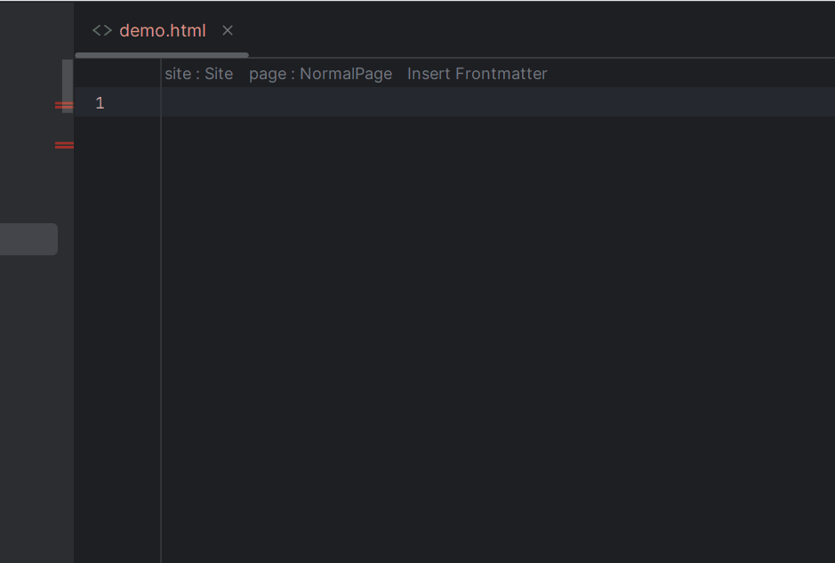

## Prerequisites

To enable Roq support, add the Roq extension to your Quarkus project:

```xml
<dependency>
    <groupId>io.quarkiverse.roq</groupId>
    <artifactId>quarkus-roq-frontmatter</artifactId>
</dependency>
```

**Automatic Detection**: The IDE automatically detects Roq projects when the `quarkus-roq-frontmatter` dependency is present in your project classpath. Once detected, all Roq-specific features are enabled automatically.

## Features

### Template Location

By default, Qute templates are scanned from `src/main/resources/templates/`. For Roq projects, the IDE recognizes additional template locations:

- **Templates**: `templates/` - Standard Qute templates
- **Content**: Configurable via `quarkus.roq.site-dir` (default: `content/`)
- **Roq directory**: Configurable via `quarkus.roq.roq-dir`

The IDE automatically indexes these locations and provides full [Qute editing support](./EditingSupport.md) for all Roq templates.

**Example**: The Roq [/content/events.html](https://github.com/quarkiverse/quarkus-roq/blob/main/blog/content/events.html) template in the `content/` folder:

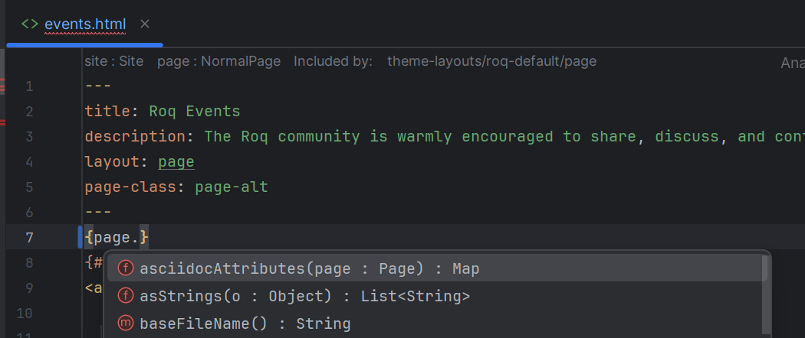

### YAML Frontmatter

Roq templates use YAML frontmatter to define page metadata at the top of template files between `---` delimiters.

#### Insert Frontmatter

The IDE provides an **"Insert Frontmatter"** quick action to add frontmatter structure:

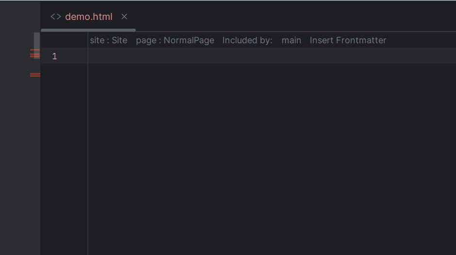

#### IDE Support

Inside frontmatter blocks, the IDE provides:
- **Property completion** - Suggests valid frontmatter properties
- **Value completion** - Context-aware value suggestions
- **Validation** - Highlights invalid YAML syntax
- **Hover** - Displays property information

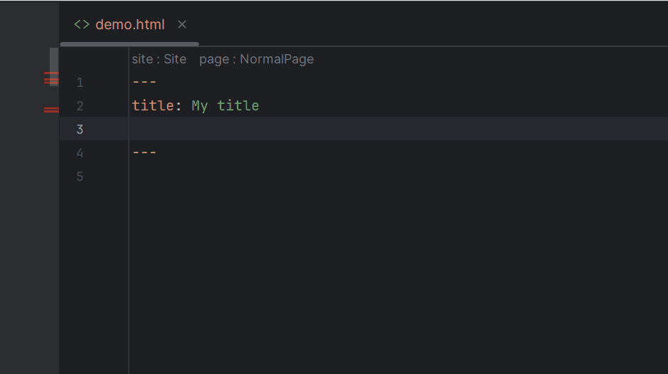

### Site and Page Data Models

Roq automatically injects `site` and `page` as global data models into your templates.

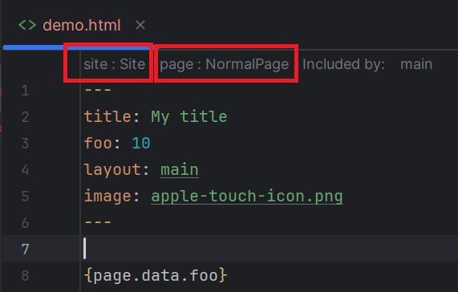

The IDE displays these injected data models as **CodeLens** at the top of the template. This means you **don't need to declare them** using [Parameter declaration](./EditingSupport.md#parameter-declaration) like:

```
{@io.quarkiverse.roq.frontmatter.runtime.model.DocumentPage page}
```

You automatically benefit from full [Qute editing support](./EditingSupport.md) without explicit declarations.

#### Page Type Injection

Depending on the template type, Roq injects different page models (except [User tags](./EditingSupport.md#user-tags)):

**Collection pages** receive [DocumentPage](https://github.com/quarkiverse/quarkus-roq/blob/main/roq-frontmatter/runtime/src/main/java/io/quarkiverse/roq/frontmatter/runtime/model/DocumentPage.java):

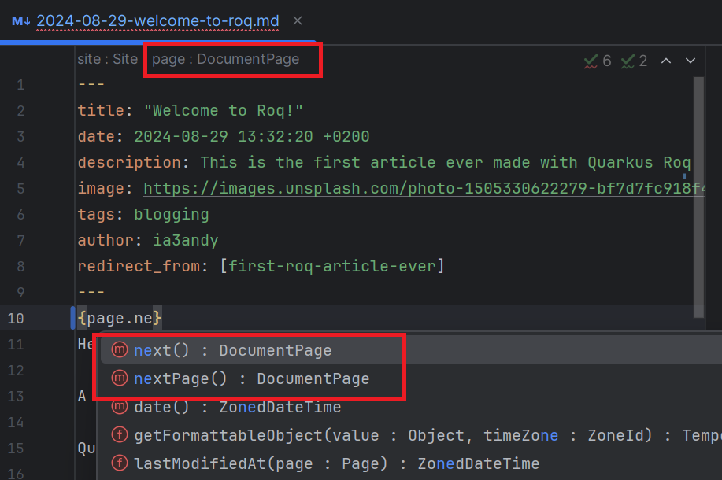

**Regular pages** receive [NormalPage](https://github.com/quarkiverse/quarkus-roq/blob/main/roq-frontmatter/runtime/src/main/java/io/quarkiverse/roq/frontmatter/runtime/model/NormalPage.java):

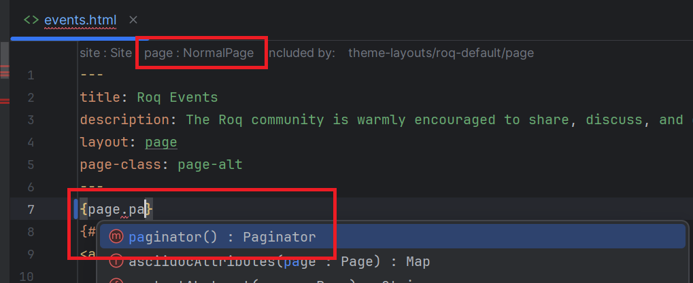

#### Page Data

`{page.data}` and `{site.data}` are JsonObject instances populated with YAML frontmatter.

**Example with `{site.data}`:**

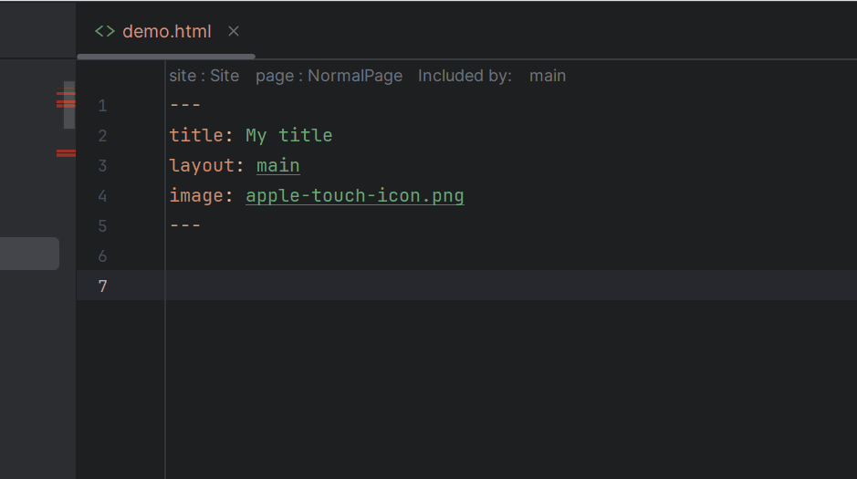

**Example with `{page.data}`:**

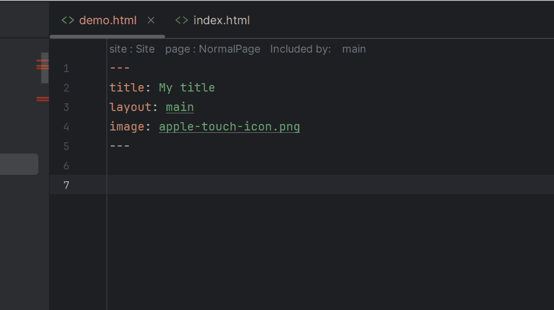

### Roq Data

Roq data can be accessed using the inject syntax:

```
{inject:data}
```

#### JSON/YAML Data Files

Roq loads data from JSON or YAML files in the `data/` directory. Access them with:

```
{inject:json-file-name}
```

**Example** with `data/contributors.json`:

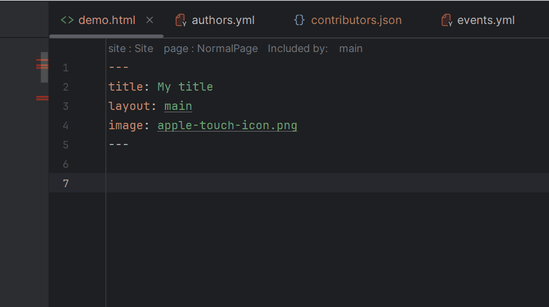

#### @DataMapping

Declare custom data collections in Java using the `@DataMapping` annotation:

```java
import io.quarkiverse.roq.data.runtime.annotations.DataMapping;
import java.time.LocalDate;
import java.util.List;

@DataMapping(value = "events", parentArray = true)
public record Events(List<Event> list) {

    public record Event(String title, String description, String date, String link) {
        
        public LocalDate parsedDate() {
            return LocalDate.parse(date);
        }
    }
}
```

**Example** with `Events` Java record:

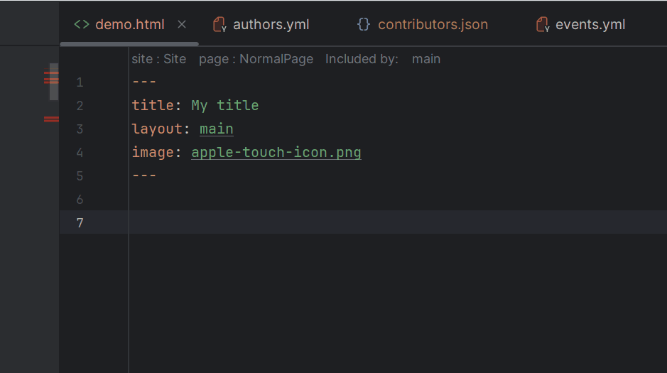

The IDE provides:
- **Completion** for data collection names
- **Type-safe property access** for record fields
- **Navigation** from template to Java record definition
- **Refactoring** support (rename records or properties)

## Next Steps

- Learn about [Qute editing features](./EditingSupport.md) available in Roq templates
- Explore [Qute debugging](./DebuggingSupport.md) for troubleshooting templates
- See [Quarkus running support](../quarkus/RunningSupport.md) to run Roq in Dev Mode

## Additional Resources

- [Roq GitHub Repository](https://github.com/quarkiverse/quarkus-roq)
- [Roq Documentation](https://docs.quarkiverse.io/quarkus-roq/dev/)
- [Qute Reference Guide](https://quarkus.io/guides/qute-reference)
